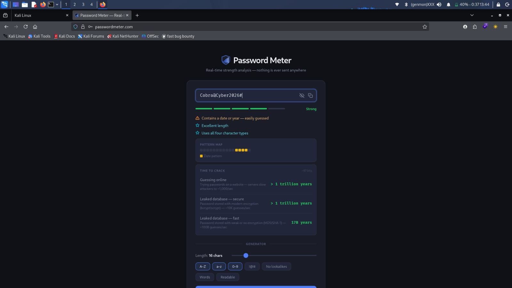
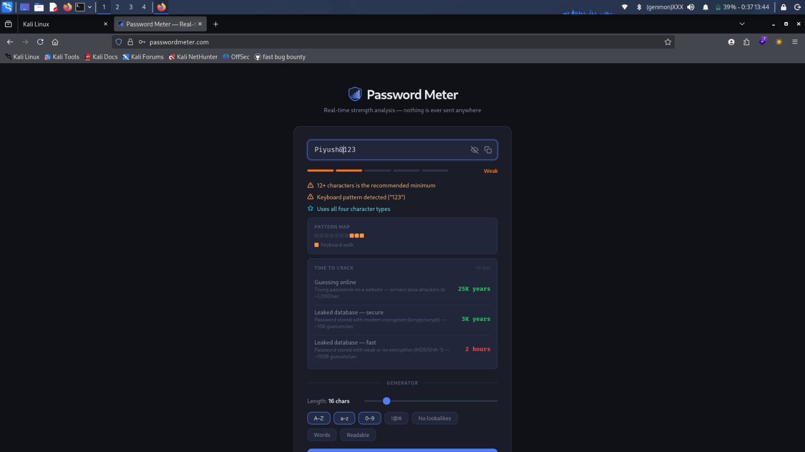
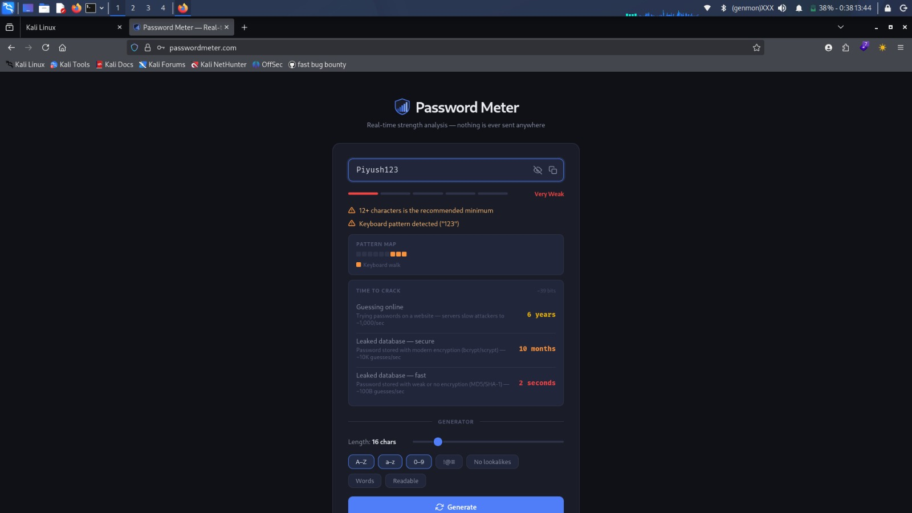
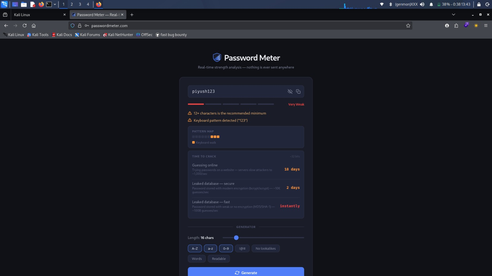

#Elevate labs internship tasks:-
Task - Create a Strong Password and Evaluate Its Strength
Objective

The objective of this task was to understand how password complexity affects security and evaluate password strength using an online password strength checker.

Tool Used
PasswordMeter (passwordmeter.com)
Passwords Tested :- 
piyush123	, Weak

Piyush123 ,	Medium

Piyush@123 , Strong

Cobra@Cyber2026#	, Very Strong

## Screenshots :- 

### Password 1 Result

### Password 2 Result

### Password 3 Result

### Password 4 Result

Observations:-
Short and predictable passwords are weak.
Adding uppercase letters improves password strength.
Special characters and numbers significantly increase complexity.
Longer passwords are more resistant to brute-force attacks.
Best Practices :-
Use at least 12–16 characters.
Include uppercase and lowercase letters.
Use numbers and special characters.
Avoid personal information and common words.
Use unique passwords for different accounts.
Enable Multi-Factor Authentication (MFA).
Common Password Attacks
Brute Force Attack

Attackers try multiple password combinations until the correct one is found.

Dictionary Attack

Attackers use lists of commonly used passwords and words.

Credential Stuffing

Leaked credentials are reused across multiple websites.

Conclusion

This task helped me understand the importance of strong passwords in cybersecurity. I learned that password length, complexity, and uniqueness play a major role in protecting accounts from unauthorized access. Using strong passwords along with MFA provides better security against common password attacks.

Author:- Cobra
